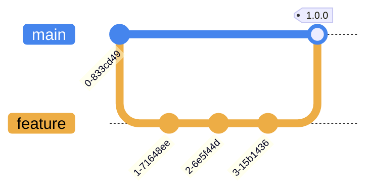

# fil-tuxedo-scripts

Jinga2 template maintenance scripts for [fil-tuxedo-stack](https://github.com/companieshouse/fil-tuxedo-stack) services.

These scripts are deployed via CI/CD jobs that utilise an Ansible playbook and are grouped by the service that the relate to. For more information refer to the [fil-tuxedo-stack deployment branch](https://github.com/companieshouse/fil-tuxedo-stack/tree/deployment) and the [Maintenance jobs](https://github.com/companieshouse/fil-tuxedo-stack/tree/deployment/roles/deploy#maintenance-jobs) section of its associated Ansible 'deploy' role documentation.

## Template scripts

The following sections detail in brief the function of each script:

CABS

| Filename | Description |
|--------|--------|
| `cabs_check.j2` | Check CABS service is running and check logs for network errors. |

EF

| Filename | Description |
|--------|--------|
| `active_auth_codes_stats.j2` | Generate active auth codes stats for the previous week and send by email. |
| `aps_letter_run.j2` | Auth code letter generation processing. |
| `auth_change_clear.j2` | Clear old entries from the auth change Informix database table. |
| `auth_change_status_check.J2` | Generate email for auth change records showing status 'v'. |
| `auth_code_stats.j2` | Generate auth code stats and send by email. |
| `auth_diss.j2` | Disable auth codes for dissolved companies. |
| `auth_letters_eshuttle.j2` | Process shuttle files and create/update/disable auth code database entries for individual companies as necessary. |
| `auth_letters_insert.j2` | Insert auth letter records into Informix EF database. |
| `auth_letters_status.j2` | Update status of auth change entries with missing auth codes. |
| `daily_letter_count_stats.j2` | Generate daily letter count stats and send by email. |
| `database_lock_check.j2` | Check ULOG for SQLSTATE errors indicating database lock and send by email. |
| `duplicate_auth_codes_check.j2` | Check for duplicate auth codes and send by email. |
| `forward_check.j2` | Check for service forwarding errors and generate email. |
| `presenter_data_transfer.j2` | Copy presenter data to S3 bucket for retrieval and processing by backend XML service instances. |
| `sqlstate_check.j2` | Check ULOG for SQLSTATE exception errors and send by email. |
| `ulog_error_check.j2` | Check ULOG for generic errors and send by email. |

Informix

| Filename | Description |
|--------|--------|
| `level_zero_backup.j2` | Perform a level zero database backup and archive the level zero backup file. |
| `logging.j2` | Common logging functions for use in other scripts. |
| `logical_log_archive.j2` | Perform logical log backup and restart continuous backups for the specified Informix database. |
| `menu.j2` | Interactive menu-based system for `informix` user database management. |
| `ois_stats_production.j2` | Generate OIS function call statistics and send email to recipients. |
| `ois_stats_update.j2` | Parse statistics files generated by [ois-tuxedo-stack](https://github.com/companieshouse/ois-tuxedo-stack) servers (output files generated by the `morestats_miu` script) and insert into prod Informix database. |
| `stop_all_logicals.j2` | Stop all logical log continuous backup processes. |
| `update_statistics.j2` | Generate and update database statistics regarding table, row, and page-count in the systables system catalog table. |

PROD

| Filename | Description |
|--------|--------|
| `db_error_check.j2` | Check prod service logs for errors indicating database update failures. |
| `sage_extract.j2` | Generate and transfer telesales data files to finance system. |

SCUD

| Filename | Description |
|--------|--------|
| `chcc_stats.j2` | Generate CHCC service stats for the previous week and send by email. |
| `chs_permissions.j2` | Update file permissions for CHS services. |
| `fiche_clean.j2` | Delete fiche files older than the specified number of days. |
| `image_metadata_clean.j2` | Delete generated image metadata files. |
| `orders_archive.j2` | Archive old SCUD orders to a separate database table. |
| `pre95_mortgages.j2` | Export pre-95 mortgage documents from Informix database to NFS shares. |
| `public_stats.j2` | Generate SCUD public search stats and send by email. |
| `qsp_check.j2` | Check SMS poll daemon log for errors indicating failures in the charging process to QSP. |
| `scanning_clean.j2` | Delete image files older than the specified number of days and delete empty scanning directories whose names being with a defined company prefix. |
| `scud_extract.j2` | Generate scud extract files containing details of the scanned documents for the day, export TIFF images, and update database with amended day numbers. |
| `scud_stats.j2` | Generate weekly statistics for scud service and send by email. |
| `sms_poll_check.j2` | Check status of SMS poll daemon and send alerts if not running. |
| `sms_poll_start.j2` | Start SMS poll daemon to prepare orders for transmission. |
| `sms_poll_stop.j2` | Stop SMS poll daemon. |
| `transmission_check.j2` | Check SMS poll daemon log for order processing errors and generate alerts. |

## Branching Strategy

This project uses a trunk-based branching strategy and changes merged to the `main` branch are incorporated into versioned artefacts via the [fil-tuxedo-scripts](https://github.com/companieshouse/ci-pipelines/blob/master/pipelines/platform/team-platform/fil-tuxedo-scripts) pipeline:

## License

This project is subject to the terms of the [MIT License](/LICENSE).
